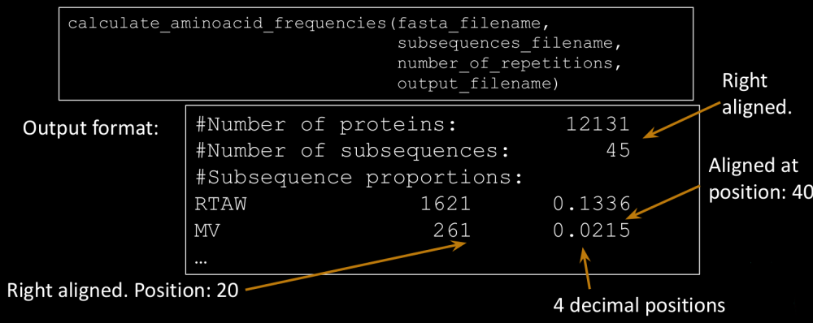

1) Create a function that, given a multi-line protein FASTA file (fasta_filename) and a
“sub-sequences” file (subsequences_filename) (one sequence in each line),
calculates the proportion of proteins in the FASTA file containing at least N-times
(number_of_repetitions) each of the sub-sequences (exactly equal). Save it in an
output file with the specified format, ordered by the proportion value
(descending order)

