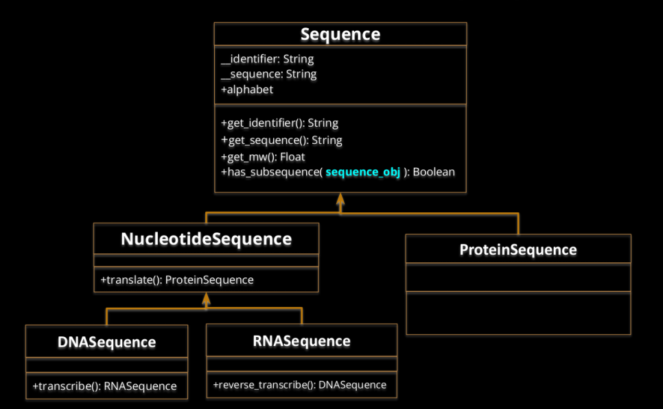

1) Define and
implement the
following classes:

Specifications:

1. alphabet must be a class attribute that specifies the possible
alphabet of the sequence.
2. When creating a new Sequence instance (ProteinSequence,
DNASequence or RNASequence), it must check that the sequence
is correct by checking in the alphabet. If not, raise an exception
with the following statement, where X is the incorrect letter:
raise ValueError(“Impossible to create instance: X not
possible”)
3. If necessary, additional attributes or methods can be created,
private or public.
4. You can find required data in a file called
sequence_dictionaries.py

Define the following behaviour:
1) len(Sequence): should return the length of the sequence.
2) sequence1 == sequence2: return True if sequence strings are exactly the
same (without taking into account the identifiers).
3) sequence1 != sequence2: return True if sequences are different, without
taking into account the identifiers.
4) Sequence + Sequence: Create a new sequence object instance with their
sequences concatenated. Sequence object has to be of the same class as the
operands. It should not be applicable to different classes (i.e. ProteinSequence,
RNASequence). The identifiers should also be concatenated with a “+” as a glue
between both identifiers.
5) Sequence[i]: should return the sequence element at position i. Position 0
corresponds to the first position.
6) in operator: should return a boolean if the string is a substring of the attribute
sequence.
7) Comparing sequences. Implement the necessary method(s) to define how
sequences should be ordered. The objective is that when sorting a list of
sequences, they are sorted according to their molecular weight.
8) Adapt the sequence class so that it can be used as key in a dictionary or it can be
added to a set. Two sequences should be considered the same object in terms of
set or key if they share both the identifier and the sequence.
