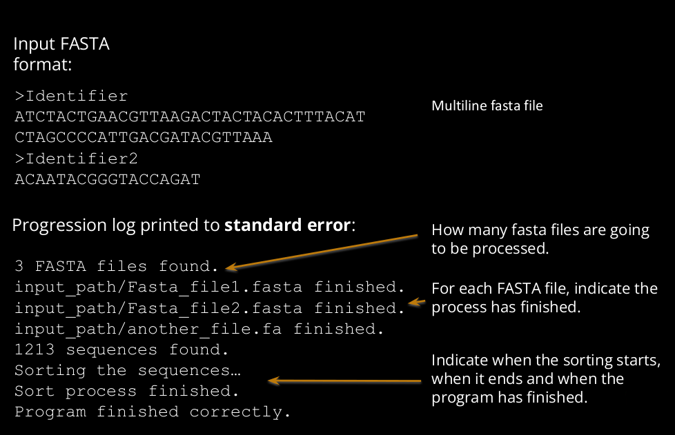

1) Create a new ValueError exception subclass named IncorrectSequenceLetter
2) To create a new exception instance, it should be created with the letter not found in the
alphabet and the class name of the sequence. Example:
e = IncorrectSequenceLetter(“B”, class_name)
3) The description string of the exception must be the following:
“The sequence item B is not found in the alphabet of class ProteinSequence”
4) Sequence class should raise an IncorrectSequenceLetter exception when a sequence
is created using an incorrect letter not found in the alphabet.
5) Modify the FASTA_iterator to be able to iterate in any type of Sequence (add a new
argument in the generator function to specify the Sequence class to use)
) Modify the FASTA_iterator generator function to skip sequences having incorrect
letters . It must capture specifically the IncorrectSequenceLetter exception. When it
happens, it should print a message of error in the standard error and continue with the
next sequence. Do not handle other types of exceptions, only IncorrectSequenceLetter
exceptions.

7) When the script is executed as a standalone application (without being imported (i.e.
code under __main__ block), the script should read input DNA FASTA file(s) and calculate
the length and molecular weight of their corresponding proteins (i.e. corresponding to
ProteinSequence instances obtained after translation). The script must print the output
to standard output or to a file. Output should be sorted by molecular weight, from
lowest to greatest.

        python3 script.py [IN] [OUT]

7.1) If the script is executed without arguments, it looks for all “.fasta” or “.fa” files in the
current directory, and process all of them with a single sorted output. Print the results to
standard output.

7.2) If the script has a single argument, it corresponds to the input. If it is a directory, it
looks for all “.fasta” or “.fa” files in the given directory, process them and print the results
in standard output. If this single argument corresponds to a file (not necessarily “.fasta”, or
“.fa”), process it and print the results in standard output.

7.3) If the script has two arguments, the first one corresponds to the input and the
second one to the output file.

7.4) The script should print to standard error a progression log

Output format:

    Identifier1     Length1     molecular_weight1
    Identifier2     Length2     molecular_weight2
    Identifier3     Length3     molecular_weight3
