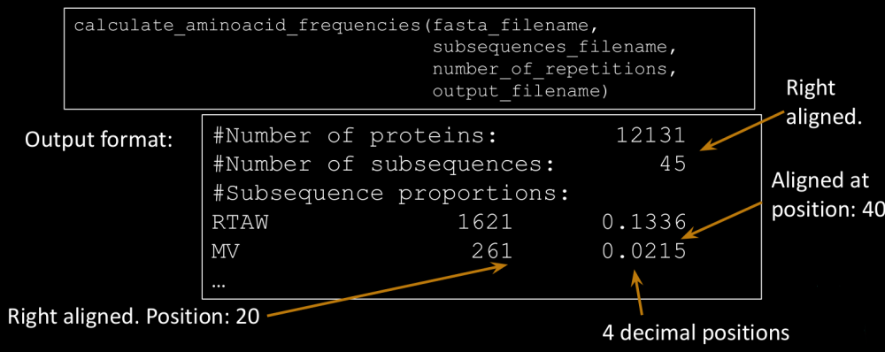

# PYTHON IN BIOINFORMATICS EXERCICSES

# Folder 1: Variables and Functions

1) Write a function that returns a float corresponding to the volume of a sphere:
    
        get_sphere_volume(radius) (formula=(4/3)πr 3 )

2) Write a function that calculates and returns an integer corresponding to the
factorial of an integer (n):
    
        a) Using recursivity: recursive_factorial(n)
        b) Without using recursivity: factorial(n)

3) Write a function for counting up numbers from 0 to n, showing the count up in the
screen. If parameter odd is set to True, prints only odd numbers

        a) Using recursivity: recursive_count_up(n, odd)
        b) Without using recursivity: count_up(n,odd)

4) Find and solve the bugs in the following function:
    
        def get_final_price(discount_percentage=10, price):
            """Return the final price after applying the discount percentage """
            return ((price + price) * percentage) / 100

# Folder 2: Strings in Bioinformatics

Input is a multiline FASTA file.

1) Given a multi-line protein FASTA file (stored in a file with path defined filename), returns a
float corresponding to the ratio of proteins in the fasta file having a relative frequency higher
or equal than a given threshold provided as an argument named “relative_threshold” and
having an absolute frequency of the same residue higher or equal than a given threshold
provided as an argument named “absolute_threshold” for a given residue. The function
should be named as follows, with the same arguments definition:

        get_proteins_ratio_by_residue_threshold(filename,
            residue,relative_threshold=0.03, absolute_threshold=10)

2) Given a protein FASTA file (filename), save on a output file named output_filename the
protein identifier, the first N-aminoacids, the last M-aminoacids and the absolute frequency
in the protein of all the aminoacids found in the protein (the aminoacids that do not appear
in the protein should not be shown). The fields must be separated by a tabulator, and one
protein by line.

        print_sequence_summary(filename,
            output_filename,
            first_n=10,
            last_m=10)

Example:

    Input: 
    >PROT1
    EFTRPTSTWSAAALMTRSSSTRWSPD
    >PROT2
    SSTPLRRSTPAWEEFGLMCCDPRS
    >PROT3
    ATRSLEWKSTPW

    Output:
    PROT1 EFT RWSPD E:1,F:1,T:5,R:3,P:2,S:6,W:2,A:3,L:1,M:1,D:1
    PROT2 SST CDPRS S:4,T:2,P:3,L:2,R:3,A:1,W:1,E:2,F:1,G:1,M:1,C:2,D:1
    PROT3 ATR KSTPW A:1,T:2,R:1,S:2,L:1,E:1,W:2,K:1,P:1

# Folder 3: Lists and Dictionaries 

1) Create a function that, given a multi-line protein FASTA file (fasta_filename) and a
“sub-sequences” file (subsequences_filename) (one sequence in each line),
calculates the proportion of proteins in the FASTA file containing at least N-times
(number_of_repetitions) each of the sub-sequences (exactly equal). Save it in an
output file with the specified format, ordered by the proportion value
(descending order)

# Folder 4: Generator Functions
1) A Generator Function that reads a Fasta file. In each iteration, the function
must return a tuple with the following format: (identifier, sequence). Function name: 

        FASTA_iterator(fasta_filename)

2) Given a list of FASTA files, create a function that returns a dictionary that contains
the 4 following keys with the associated values:
    - “intersection”: a set with the common identifiers found in all the files
    - “union”: a set with all the identifiers (unique) found in all the files
    - “frequency”: a dictionary with all the identifiers as keys and the number of files
    in which it appears as values (int)
    - “specific”: a dictionary with the name of the input files as keys and a set with the
    specific identifiers as values (i.e. identifiers that are exclusive in that fasta file)

>
    Note 1: Common identifier equivalence must be case-insensitive (i.e. Code_A,code_a and
    CODE_A are equivalents).

    Note 2: It must use the FASTA_iterator function created in exercise 1.

    Function name:
    compare_fasta_file_identifiers( fasta_filenames_list )
# Folder 5: Builtin Functions (Map, Zip, ...)
Note: Use the FASTA_iterator function created in last exercises.

1) Repeat the same exercises proposed in session 2 but using the FASTA_Iterator
function created in session 4 to read the FASTA files.

2) A function that, given a multiline FASTA file, returns the length of the sequence
with the maximum length

        get_max_sequence_length_from_FASTA_file( fasta_filename )

3) A function that, given a multiline FASTA file, returns the length of the sequence
with the minimum length

        get_min_sequence_length_from_FASTA_file ( fasta_filename )

4) A function that, given a FASTA file, returns a list of tuples (identifier, sequence)
corresponding to the sequence(s) with maximum length. The list must be sorted
by the identifier (case insensitive sorted).

        get_longest_sequences_from_FASTA_file( fasta_filename )

5) A function that, given a FASTA file, returns a list of tuples (identifier, sequence)
corresponding to the sequence(s) with minimum length. The list must be sorted by
the identifier (case insensitive sorted).

        get_shortest_sequences_from_FASTA_file( fasta_filename )

6) A function that, given a protein FASTA file, returns a dictionary with the molecular
weights of all the proteins in the file. The dictionary keys must be the protein
identifiers and the associated values must be a float corresponding to the molecular
weight.

        get_molecular_weights( fasta_filename )

7) A function that, given a protein FASTA file, returns a tuple with (identifier,
sequence) of the protein with the lowest molecular weight. If there are two or more
proteins having the minimum molecular weight, just return the first one.

        get_sequence_with_min_molecular_weight( fasta_filename )

8) A function that, given a protein FASTA file, returns the mean of the molecular
weights of all the proteins

        get_mean_molecular_weight( fasta_filename )

# Folder 6: PDB (Protein Data Bank) file analysis with Python

Create a python function that calculates the mean of the minimum distance between any two residues
pairs found in the same chain of a PDB. The script, when executed by command line, should output in
standard output the mean distance for each chain (with 4 decimal positions). The python script should use
a single argument corresponding to the PDB file path to use. This command line argument is optional. If
the PDB file path is not defined, read the PDB file from standard input.
The function must return a dictionary with chains as keys and mean minimum distances as values. It uses
a single argument which specifies the path of the PDB file If the argument pdb_file_path is None, read the
PDB file from standard input.

    calculate_pdb_chain_mean_minimum_distances(pdb_file_path)

When the file is imported as a module, it should not execute the function. The function should only be
called when the script is executed by command line.

        Sample output in command line:
        A: 22.7400
        B: 20.4224
        N: 23.9393
        F: 23.9730
        J: 23.4187

# Folder 7: Intro to OOP for Bioinformatics

1) Define a new class named Protein, with the following definition. If
necessary, you can define the private methods you need

        # Protein

        +identifier: String

        +sequence: String

        ---

        +get_identifier(): string

        +get_sequence(): string

        +get_mw(): float

        +has_subsequence( Protein): boolean

        +get_length(): integer

2) Modify the FASTA_iterator generator function to yield Protein objects
instead of tuples. In each iteration, the function must yield a Protein
Object:
FASTA_iterator( fasta_filename )

# Folder 8: OOP Inheritance and Magic (Dunder) Methods

1) Define and
implement the
following classes:

Specifications:

1. alphabet must be a class attribute that specifies the possible
alphabet of the sequence.
2. When creating a new Sequence instance (ProteinSequence,
DNASequence or RNASequence), it must check that the sequence
is correct by checking in the alphabet. If not, raise an exception
with the following statement, where X is the incorrect letter:
raise ValueError(“Impossible to create instance: X not
possible”)
3. If necessary, additional attributes or methods can be created,
private or public.
4. You can find required data in a file called
sequence_dictionaries.py

Define the following behaviour:
1) len(Sequence): should return the length of the sequence.
2) sequence1 == sequence2: return True if sequence strings are exactly the
same (without taking into account the identifiers).
3) sequence1 != sequence2: return True if sequences are different, without
taking into account the identifiers.
4) Sequence + Sequence: Create a new sequence object instance with their
sequences concatenated. Sequence object has to be of the same class as the
operands. It should not be applicable to different classes (i.e. ProteinSequence,
RNASequence). The identifiers should also be concatenated with a “+” as a glue
between both identifiers.
5) Sequence[i]: should return the sequence element at position i. Position 0
corresponds to the first position.
6) in operator: should return a boolean if the string is a substring of the attribute
sequence.
7) Comparing sequences. Implement the necessary method(s) to define how
sequences should be ordered. The objective is that when sorting a list of
sequences, they are sorted according to their molecular weight.
8) Adapt the sequence class so that it can be used as key in a dictionary or it can be
added to a set. Two sequences should be considered the same object in terms of
set or key if they share both the identifier and the sequence.

# Folder 9: Exception handling 

(to be uploaded)
